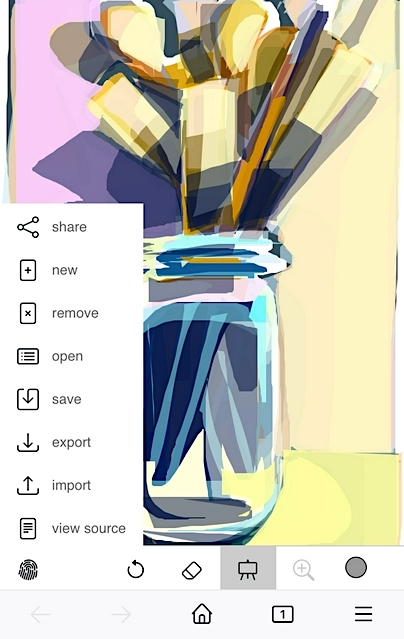
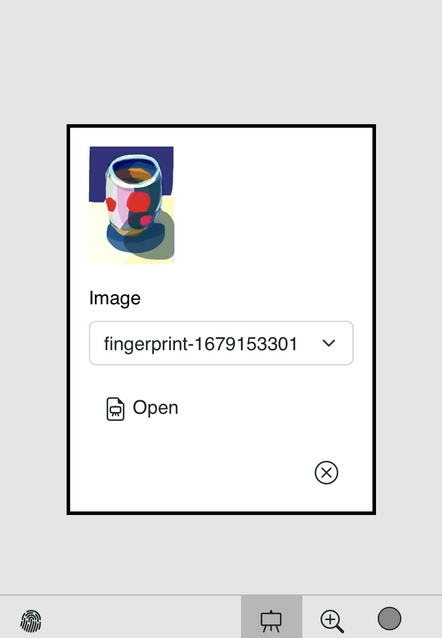
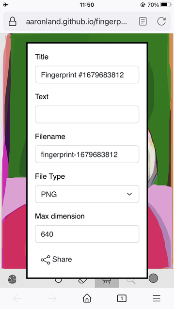
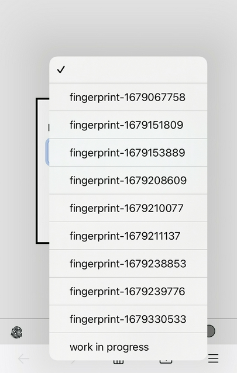
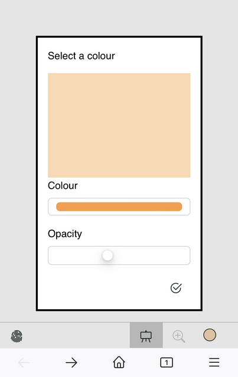

# fingerprint

None of the other digital drawing tools were my jam, so I wrote my own. It's called `fingerprint`.

## Description

`fingerprint` is an opionated vector drawing application built on top of Dimitry Baranovskiy's [raphael.js](https://github.com/DmitryBaranovskiy/raphael) and a modified version of Ian Li's [raphael-sketchpad](https://github.com/ianli/raphael-sketchpad/).

It is a single-page HTML5 web application for drawing closed paths (technically strokes that automatically close themselves) filled with a single colour (and opacity). The application has the ability to "undo" and "redo" individual paths as well the ability to remove individual paths by clicking on them (but I almost never use the feature). That's all it does, by design.

Here's why, extracted from [a blog post](https://www.aaronland.info/weblog/2023/03/06/fur/#tomalesbay) I wrote about making "drawing" using Apple's Freeform application:

> A few years ago I got an iPad and an Apple Pencil to try "drawing" pictures with. I hated it. It's all very impressive technology and there's no question that other people are making some remarkable images with it. It is not my medium, though. Fast forward to last year when Apple started bundling their Freeform shared-whiteboarding application in iOS. Among other things, the application allows you to make freehand drawings using a small set of "tools" one of them being a bezier-fill tool that automatically closes any path you draw and fills it with the selected colour. These images were made this way. Unlike the Pencil and the many sketching apps which attempt to mimic real-world, analog, tools one of the reasons I find the bezier-fill tool fascinating is because it feels uniquely digital. ... If there's documentation on the file format that the Freeform application stores things in I haven't been able to find it. Nor have I been able to find where the files are stored, either on my phone or my laptop. The only way I've found to export these images is as PDF files. Once they are exported as PDF files they are also encoded as raster images rather than the native vector graphics I assume them to be. This is disappointing because in my efforts to figure out how to give these images some degree of permanence outside of a digital infrastructure it would be helpful to have the raw vector instructions. Sol Lewitt jokes are left as an exercise to the reader.

So, this is that tool (sort of) but a tool whose native format is SVG. This is a tool I built by, and for, myself. It is being shared in the spirit of generousity but it may not be the right tool for you. That's okay. None of the other tools were right for me. This one isn't perfect but at least I know and understand its constraints and it's something that can be improved.

## Demo

https://aaronland.github.io/fingerprint/

Notes:

* This has been tests on desktop Firefox and Safari and iOS.
* Offline support (service workers) for the demo application is not enabled at this time (see comments below).

## Features

### Import and Export

Individual drawings can be exported as PNG, SVG and JSON files on devices that support the [File API](https://developer.mozilla.org/en-US/docs/Web/API/File_API). Drawings, stored in the SVG format, can be re-imported in to the application (assuming support for the `File` API).

### Sharing

Images can be "shared" (as PNG and SVG documents) on devices that support the [Web Share API](https://developer.mozilla.org/en-US/docs/Web/API/Web_Share_API).

### Local storage

There is also support for saving and loading individual drawings to the browser's local cache, using the [localforage](https://github.com/localForage/localForage) library. The application will also "auto save" the current drawing every 60 seconds (to a cache entry named `work in progress`). This is largely to account for the fact that there are many scenarios in a web application context in which a drawing can be lost.

### Offline support

The application is designed to work offline for devices that support the [Service Workers API](https://developer.mozilla.org/en-US/docs/Web/API/Service_Worker_API). This works but should probably still be considered unstable. Support, or at least documentation, for Service Workers across platforms is inconsistent and they appear to be causing problems with the local caching functionality.

### Colour picker

Unfortunately the HTML 5 colour picker `input` control specification does not require a built-in opacity control so there is more button-pressing to adjust colours than I would like. I suppose I could use a pure JavaScript implementation but that is still a project for another day.

## Still to do

The goal for the application is to develop the ability to:

* [Zoom in and out of an SVG canvas.](https://github.com/aaronland/fingerprint/issues/1) _This is probably the next thing I work on since I make these drawings with my fingers and the inability to zoom in to an image makes detailed work difficult._
* [Enlarge (or shrink) the SVG canvas, redrawing the current image in the center of the (new) canvas.](https://github.com/aaronland/fingerprint/issues/2)
* [Smoothing of paths using Bezier curves, or a functional equivalent.](https://github.com/aaronland/fingerprint/issues/4)

Suggestions, or contributions, on how to implement any of these features is welcomed.

## See also

### JavaScript

* https://github.com/DmitryBaranovskiy/raphael
* https://github.com/ianli/raphael-sketchpad/
* https://github.com/eligrey/FileSaver.js/ 
* https://github.com/apvarun/toastify-js
* https://github.com/localForage/localForage

### HTML 5

* https://developer.mozilla.org/en-US/docs/Web/API/File_API
* https://developer.mozilla.org/en-US/docs/Web/API/Web_Share_API
* https://developer.mozilla.org/en-US/docs/Web/API/Service_Worker_API
* https://developer.mozilla.org/en-US/docs/Web/HTML/Element/input/color

### Graphic design

* https://icons.getbootstrap.com/
