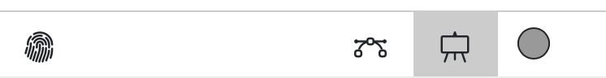
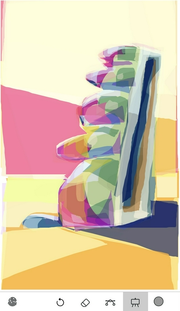
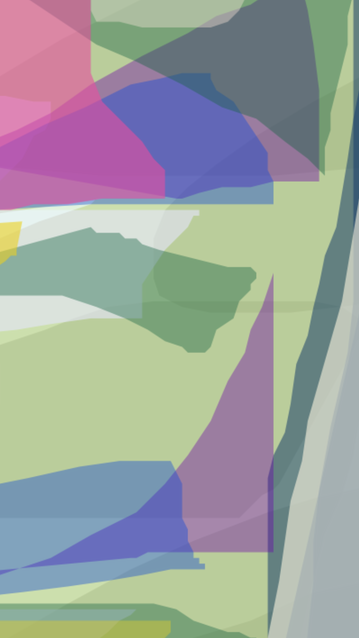
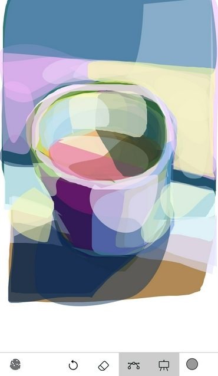
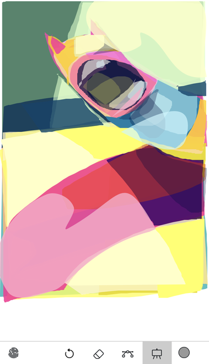
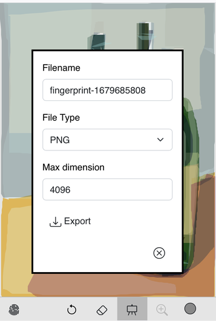
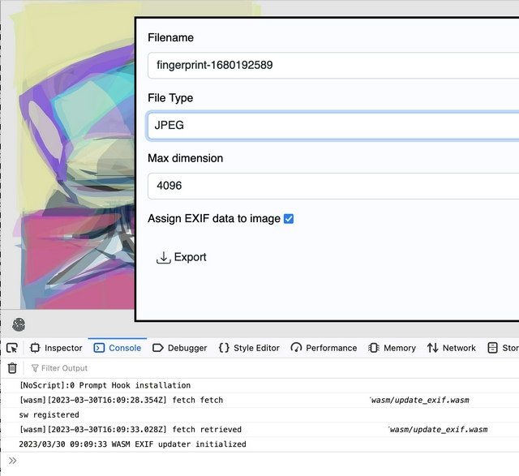
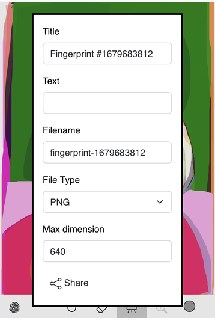
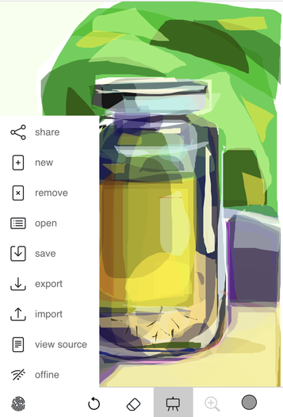

# fingerprint

None of the other digital drawing tools were my jam, so I wrote my own. It's called `fingerprint`.

## Description


`fingerprint` is an opionated vector drawing application built on top of Dimitry Baranovskiy's [raphael.js](https://github.com/DmitryBaranovskiy/raphael) and a modified version of Ian Li's [raphael-sketchpad](https://github.com/ianli/raphael-sketchpad/).

It is a single-page HTML5 web application for drawing closed paths (technically strokes that automatically close themselves) filled with a single colour (and opacity). The application has the ability to "undo" and "redo" individual paths as well the ability to remove individual paths by clicking on them (but I almost never use the feature). That's all it does, by design.

Here's why, extracted from [a blog post](https://www.aaronland.info/weblog/2023/03/06/fur/#tomalesbay) I wrote about making "drawing" using Apple's Freeform application:

> A few years ago I got an iPad and an Apple Pencil to try "drawing" pictures with. I hated it. It's all very impressive technology and there's no question that other people are making some remarkable images with it. It is not my medium, though. Fast forward to last year when Apple started bundling their Freeform shared-whiteboarding application in iOS. Among other things, the application allows you to make freehand drawings using a small set of "tools" one of them being a bezier-fill tool that automatically closes any path you draw and fills it with the selected colour. These images were made this way. Unlike the Pencil and the many sketching apps which attempt to mimic real-world, analog, tools one of the reasons I find the bezier-fill tool fascinating is because it feels uniquely digital. ... If there's documentation on the file format that the Freeform application stores things in I haven't been able to find it. Nor have I been able to find where the files are stored, either on my phone or my laptop. The only way I've found to export these images is as PDF files. Once they are exported as PDF files they are also encoded as raster images rather than the native vector graphics I assume them to be. This is disappointing because in my efforts to figure out how to give these images some degree of permanence outside of a digital infrastructure it would be helpful to have the raw vector instructions. Sol Lewitt jokes are left as an exercise to the reader.

So, this is that tool (sort of) but a tool whose native format is SVG. This is a tool I built by, and for, myself. It is being shared in the spirit of generousity but it may not be the right tool for you. That's okay. None of the other tools were right for me. This one isn't perfect but at least I know and understand its constraints and it's something that can be improved.

## Demo

https://aaronland.github.io/fingerprint/

Notes:

* This has been tests on desktop Firefox and Safari and iOS.
* Offline support (service workers) for the demo application is not enabled at this time (see comments below).

## Install

Copy the `www/index.html.example` file to `www/index.html` and adjust as necessary, then open in a web browser.

The reason for this extra step is that offline support is configured via the `data-offline-scope` property of the `body` element in the index file. By default this is empty which signals that offline support is disabled. Rather than assume everyone will have the same "scope" (the URI path under which the offline application is configured) it is left as a deliberate step for each user to configure.

Consult the [Offline support](https://github.com/aaronland/fingerprint#offline-support) section for a longer discussion about how offline support works (and sometimes doesn't work).

## Features

_As of this writing this documentation contains a mix of screenshots from both the initial `v0.1.0` and current (`v0.2.0` or higher) releases. The principal difference is the removal of the "zoom" (or maginifying glass) icon and the addition of the "curve" (or drawing mode) icon in the bottom navigation bar. The latter was added to support drawing paths as cubic bezier curves and the former was removed because it never worked (see [issue #1](https://github.com/aaronland/fingerprint/issues/1)) and was taking up space. Eventually all the screenshots will be updated to reflect the current state of the user interface but not today. Also all of these screenshots were scaled using the wrong colour space profile so they are all more muted than the original drawings which is super annoying but it is what it is and will be fixed eventually._

### Drawing Mode



The default drawing mode for paths is `Lines` mode. It is possible to toggle between `Lines` and `Curves` mode using "curves" icon to the left of the drawing (or canvas) icon.

#### Lines



The default type (or "command" as defined in the SVG docs) for paths is the [line command](https://developer.mozilla.org/en-US/docs/Web/SVG/Tutorial/Paths#line_commands) which is a series of `x,y` coordinates connected by straight lines.

This can produce images with visible "steps" when drawing curves or other non-rectilinear paths, particularly small ones on small device screens.



#### Curves



It is also possible to draw paths using the [cubic curve command](https://developer.mozilla.org/en-US/docs/Web/SVG/Tutorial/Paths#b%C3%A9zier_curves) which consists of three pairs or `x,y` coordinates which are used to render a smooth Bezier curve.

Under the hood this is taking the `x,y` coordinates collected by the default "line" drawing mode, [deriving a simplified path](https://mourner.github.io/simplify-js/) and using the result to derive the coordinates for a Bezier curve using a [JavaScript implementation](https://github.com/soswow/fit-curve) of Philip J. Schneider's "Algorithm for Automatically Fitting Digitized Curves". As of this writing there are no other optimizations or corrections made when deriving cubic curve paths and, as a result, the paths are often visibly "wobbly" and can change shape as they are drawn. In time this will be addressed.



It is possible to use both `Lines` and `Curves` in a single drawing.

### Import and Export

Individual drawings can be exported as PNG, JPEG, SVG and JSON files on devices that support the [File API](https://developer.mozilla.org/en-US/docs/Web/API/File_API). Drawings, stored in the SVG format, can be re-imported in to the application (assuming support for the `File` API).




#### JPEG exports and EXIF data

JPEG exports have the option of writing the value of the drawing's `x-fingerprint-date` attribute to the `DateTime`, `DateTimeOriginal` and `DateTimeDigitized` EXIF headers using the [sfomuseum/go-exif-update](https://github.com/sfomuseum/go-exif-update#update-exif-wasm-demo) WebAssembly (WASM) binary. 



For example, the following EXIF headers were written to the exported image (in the screenshot above):

```
$> exiv2 -pa /usr/local/downloads/fingerprint-1680192589.jpg 
Exif.Image.ExifTag                           Long        1  100
Exif.Photo.DateTimeDigitized                 Ascii      25  2023-03-30T16:10:15.369Z
Exif.Image.DateTime                          Ascii      25  2023-03-30T16:10:15.369Z
Exif.Image.DateTimeOriginal                  Ascii      25  2023-03-30T16:10:15.369Z
```

The option to write EXIF headers is disabled if there is a problem fetching or initializing the WASM binary. There are a few caveats for JPEG exports with EXIF headers:

* There is an outstanding issue for how the `x-fingerprint-date` attribute is preserved (or more specifically not preserved) across imports. This is being tracked in [issue #9](https://github.com/aaronland/fingerprint/issues/9).
* If you are exporting images in iOS the default behaviour is to write the image as a [Blob](https://developer.mozilla.org/en-US/docs/Web/API/Blob) URL to a browser window which can then be "saved" to the device. During this second step iOS will add its own EXIF headers including new values for the date headers written by the `fingerprint` application. It is (should be) possible to preserve EXIF dates, as written by the `fingerprint` application, by using the [share](#jpeg-sharing-and-exif-data) feature but that is dependent on your web browser supporting the `Web Share` API.
* It is not possible to assign other EXIF headers yet. This may be revisited in future versions. For details, consult the [Updating EXIF metadata in JavaScript (and WebAssembly)](https://millsfield.sfomuseum.org/blog/2021/04/14/exif/) blog post.

### Sharing

Images can be "shared" (as a PNG, JPEG or SVG document) on devices that support the [Web Share API](https://developer.mozilla.org/en-US/docs/Web/API/Web_Share_API).



#### JPEG sharing and EXIF data

Unlike with [exports](#jpeg-exports-and-exif-data) date information as written by the `fingerprint` application is preserved. To be precise it _should_ be preserved. That's what my testing indicates but if you told me your browser, or operating system, was doing something different I would not be surprised.

As with exports, the following caveats still apply:

* There is an outstanding issue for how the `x-fingerprint-date` attribute is preserved (or more specifically not preserved) across imports. This is being tracked in [issue #9](https://github.com/aaronland/fingerprint/issues/9).
* It is not possible to assign other EXIF headers yet. This may be revisited in future versions. For details, consult the [Updating EXIF metadata in JavaScript (and WebAssembly)](https://millsfield.sfomuseum.org/blog/2021/04/14/exif/) blog post.

### Local storage

There is also support for saving and loading individual drawings to the browser's local cache, using the [localforage](https://github.com/localForage/localForage) library. The application will also "auto save" the current drawing every 60 seconds to a cache entry named `work in progress`. This is largely to account for the fact that there are many scenarios in a web application context by which a drawing can be lost.


### Offline support

The application is designed to work offline for devices that support the [Service Workers API](https://developer.mozilla.org/en-US/docs/Web/API/Service_Worker_API). This works but should probably still be considered unstable. Support, or at least documentation, for Service Workers across platforms is inconsistent and they appear to be causing problems with the local caching functionality.



Offline support is disabled by default. To enable offline support adjust the `data-offline-scope` attribute of the `body` in the `index.html` to be the value of [the scope used to register the Service Worker](https://developer.mozilla.org/en-US/docs/Web/API/Service_Worker_API/Using_Service_Workers#registering_your_worker).

The interaction between an application's [Service Worker definition file](www/sw.js) and the browser's application cache (that caches the files defined by the Service Worker) remains a bit of a mystery to me. [Specifically, changing the Service Worker's cache key does not always invalidate existing caches.](https://stackoverflow.com/questions/41636754/how-to-clear-a-service-worker-cache-in-firefox/41675764#41675764) This can make updating an instance of the `fingerprint` application that has enabled offline support challenging where "challenging" means that changes aren't reflected and the only way to deal with the problem is to remove all the application data for the entire domain (hosting the `fingerprint` application). That's not ideal so, there is also a `settings` menu option when offline support is enabled.


The settings menu will open a new dialog with the option to purge the application cache, but only for the `fingerprint` application.


Purging the application will trigger a confirmation dialog. If you are purging the application cache will offline you will be presented with a second confirmation dialog to ensure that's what you really want to do. Purging the application cache while you are offline will effectively disable offline support for the `fingerprint` and the application won't work again until you are online again and can fetch the application files from source.


_Note: Because offline support depends on Service Workers it will not be available if a device is running under Mac OS or iOS [with Lockdown mode enabled](https://webkit.org/blog/13966/webkit-features-in-safari-16-4/)._

### Undo and Redo (and delete an individual path)

The application maintains a history of paths drawn so you can undo or redo individual paths. There is also an option to delete an individual path on screen, regardless of whether or not it is in the application's current history. I almost never use this feature and am on the fence about whether to keep it in the interface.


### Colour picker

Unfortunately the HTML 5 colour picker `input` control specification does not require a built-in opacity control so there is more button-pressing to adjust colours than I would like. I suppose I could use a pure JavaScript implementation but that is still a project for another day.


### View source

On platforms where the [Clipboard API](https://developer.mozilla.org/en-US/docs/Web/API/Clipboard_API) is enabled the `view source` window also allows you to copy the SVG representation of an image directly to your device's clipboard. If not you'll need to manually copy and paste the SVG.


## Still to do

The goal for the application is to develop the ability to:

* [Zoom in and out of an SVG canvas.](https://github.com/aaronland/fingerprint/issues/1) _This is probably the next thing I will work on since I make these drawings with my fingers and the inability to zoom in to an image makes detailed work difficult._
* [Enlarge (or shrink) the SVG canvas, redrawing the current image in the center of the (new) canvas.](https://github.com/aaronland/fingerprint/issues/2)

Suggestions, or contributions, on how to implement any of these features is welcomed.

## See also

### JavaScript

* https://github.com/DmitryBaranovskiy/raphael
* https://github.com/ianli/raphael-sketchpad/
* https://github.com/eligrey/FileSaver.js/ 
* https://github.com/apvarun/toastify-js
* https://github.com/localForage/localForage
* https://mourner.github.io/simplify-js/
* https://github.com/soswow/fit-curve

### HTML 5

* https://developer.mozilla.org/en-US/docs/Web/API/File_API
* https://developer.mozilla.org/en-US/docs/Web/API/Web_Share_API
* https://developer.mozilla.org/en-US/docs/Web/API/Service_Worker_API
* https://developer.mozilla.org/en-US/docs/Web/API/Clipboard_API
* https://developer.mozilla.org/en-US/docs/Web/HTML/Element/input/color

### WebAssembly (WASM)

* https://github.com/sfomuseum/go-exif-update/
* https://github.com/sfomuseum/go-http-wasm/tree/main/static/javascript

### Graphic design

* https://icons.getbootstrap.com/

### Go

* https://github.com/aaronland/go-fingerprint
